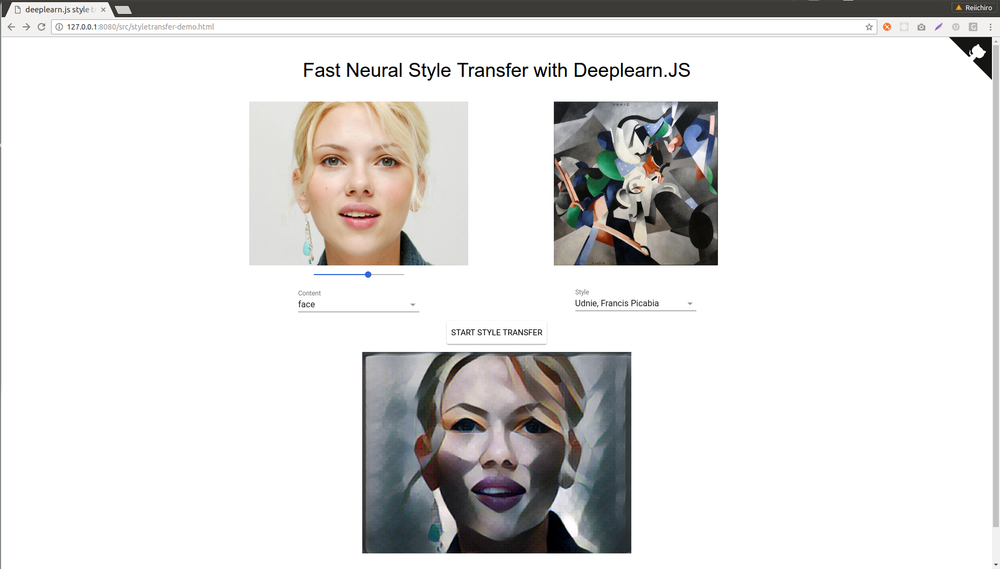

# Fast Neural Style Transfer in browser with deeplearn.js

DEPRECATED: This repository has been deprecated and is no longer actively maintained (build instructions no longer work either). There is a much, much better version (where you can use ANY style) at https://github.com/reiinakano/arbitrary-image-stylization-tfjs. If you're *really* interested in this version of fast style transfer, this code has been integrated into the [ml5.js](https://github.com/ml5js/ml5-library) library and the TensorFlow.js version is actively maintained over there.

This repository contains an implementation of the Fast Neural Style Transfer algorithm running fully inside a browser using the Deeplearn.JS library.

Demo website: https://reiinakano.github.io/fast-style-transfer-deeplearnjs



## FAQ

### What is this about?

This is an implementation of the Fast Neural Style Transfer algorithm running purely on the browser using the Deeplearn.JS library. Basically, a neural network attempts to "draw" one picture, the Content, in the style of another, the Style.

### Is my data safe? Can you see my webcam pics?

Your data and pictures here never leave your computer! In fact, this is one of the main advantages of running neural networks in your browser. Instead of sending us your data, we send *you* both the model *and* the code to run the model. These are then run by your browser.

### How big are the models I'm downloading?

For each available style, your browser will download a model around ~6.6MB in size. Be careful if you have limited bandwidth (mobile data users).

### The web page is ugly.

I know. Sorry, I'm not really a UI designer. I have about a 10 minute tolerance for tweaking HTML and CSS until I give up. The good news is, it's all open source on Github! If you want to help improve the page's design, please send a pull request! :)

## Development

To run this locally, clone the project and prepare the development environment:

```bash
$ git clone https://github.com/reiinakano/fast-style-transfer-deeplearnjs.git
$ cd fast-style-transfer-deeplearnjs
$ npm install && bower install # Install node modules and bower components
```

To interactively develop the application

```bash
$ ./scripts/watch-demo src/styletransfer-demo.ts
>> Waiting for initial compile...
>> 1023189 bytes written to src/bundle.js (0.71 seconds) at 2:20:06 AM
>> Starting up http-server, serving ./
>> Available on:
>>   http://127.0.0.1:8080
>> Hit CTRL-C to stop the server
```

The application will be available at `http://localhost:8080/src/styletransfer-demo.html` and will watch for changes of typescript code.

## Adding your own styles

The way Fast Neural Style Transfer works is, one has to train a new neural network for each "Style" image and upload it to the server. Training takes 4-6 hours on a relatively powerful GPU (Maxwell Titan X).

To train your own style model from scratch, please follow the instructions from this [Github repository](https://github.com/lengstrom/fast-style-transfer) to get your own .ckpt file. You will need Python, Tensorflow, and a decent GPU.

Once you have the `model.ckpt` file for your style, run the following:

```bash
$ python scripts/dump_checkpoint_vars.py --output_dir=src/ckpts/my-new-style --checkpoint_file=/path/to/model.ckpt
$ python scripts/remove_optimizer_variables.py --output_dir=src/ckpts/my-new-style
```

If all goes well, `src/ckpts/my-new-style` should contain ~6.7MB of 49 items including a `manifest.json` file.

Adding the style to the application is then as simple as modifying the `STYLE_MAPPINGS` variable in `src/styletransfer-demo.ts`.

If you're able to successfully achieve cool new styles, I'd be glad to add them to this demo!

## Credits

Credits belong to the following:

* The authors of the original [Neural Style Transfer paper](https://arxiv.org/abs/1508.06576).
* The authors of the paper introducing [Real-Time Style Transfer](https://arxiv.org/abs/1603.08155).
* The author of the [fast-style-transfer](https://github.com/lengstrom/fast-style-transfer) Github repository.
* The authors of [Deeplearn.JS](https://github.com/PAIR-code/deeplearnjs)
